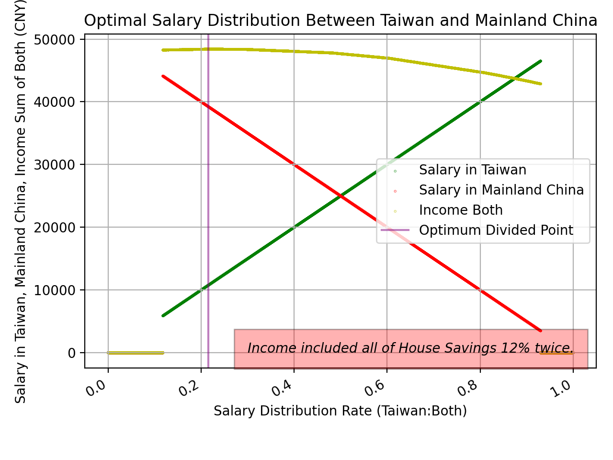
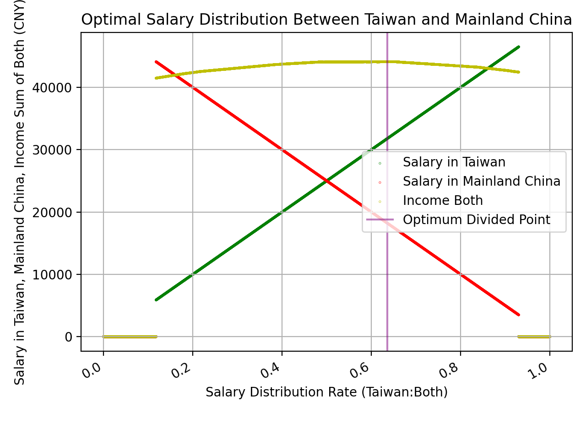

# OptimalSalaryDivideBetweenMainlandChinaAndTaiwan

幫助自己談薪時，算出一個對自己與雇主，都性價比最好的數字。

---

## 範例

設定一些台幹常見的約束條件：

- 繳交台灣的健保、勞保、所得稅  
```taiwanTax = TaiwanTax(salary_TWD)```

- 不繳交中國大陸的養老保險、失業保險
- 住房公積金拉滿到12%，雇主與個人同比例繳交  
```mainlandChinaTax = MainlandChinaTax(salary_CNY, house_savings_rate=0.12, is_retirement=False, is_unemployment_insurance=False)```

- 住房公積金雖然預設上是扣項，但我們想長期在大陸發展，算成到手部分，反正離職也能領出  
```real_income_CNY = mainlandChinaTax.salary_after_tax() + mainlandChinaTax.house_savings() * 2```

輸出：  
```bash
請輸入期望月薪資(CNY): 50000
2023-01-18 人民幣兌台幣匯率: 4.48

最佳分配: 
- 在台領薪資(TWD): 48195.840000000004
- 在陸領薪資(CNY): 39242
- 申報薪資比率(台:陸): 0.27414504867234085
- 到手總和(CNY)(計入勞資雙方公積金): 48408.779767857144
- 到手比率(%): 0.9681755953571429

1:1分配: 
- 在台領薪資(TWD): 112000.00000000001
- 在陸領薪資(CNY): 25000
- 申報薪資比率(台:陸): 1.0
- 到手總和(CNY)(計入勞資雙方公積金): 47657.96019345238
- 到手比率(%): 0.9531592038690476
```




---

## 同場加映：如果不繳住房公積金？

上圖可以看到，最佳分割點，在大陸這邊；假如不繳公積金，那最佳分割點應該會跑到台灣那邊。

是不是這樣呢？我們把住房公積金比率設為0，其他條件不變  
```mainlandChinaTax = MainlandChinaTax(salary_CNY, house_savings_rate=0, is_retirement=False, is_unemployment_insurance=False)```

輸出：  
```bash
請輸入期望月薪資(CNY): 50000
2023-01-18 人民幣兌台幣匯率: 4.48

最佳分配: 
- 在台領薪資(TWD): 142495.36000000002
- 在陸領薪資(CNY): 18193
- 申報薪資比率(台:陸): 1.7483097894794701
- 到手總和(CNY)(計入勞資雙方公積金): 44103.00937559524
- 到手比率(%): 0.8820601875119048

1:1分配: 
- 在台領薪資(TWD): 112000.00000000001
- 在陸領薪資(CNY): 25000
- 申報薪資比率(台:陸): 1.0
- 到手總和(CNY)(計入勞資雙方公積金): 44057.96019345238
- 到手比率(%): 0.8811592038690477
```



最佳解的確是跑到台灣那邊，但是到手比率卻是0.88，比繳公積金的時候還要低一點點。

所以，公積金是非常好的節稅工具。